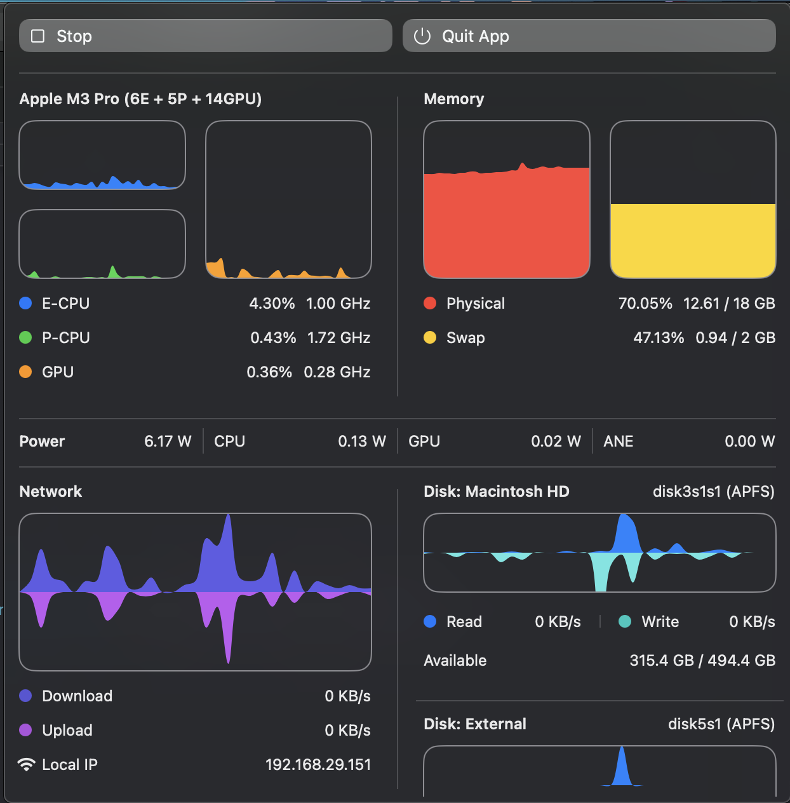

# StatsBar

An statusbar/menubar app for system stats and info for MAC OS (Apple silicon).

References
 - [Medium](https://medium.com/@vladkens/how-to-get-macos-power-metrics-with-rust-d42b0ad53967)
 - [Stats](https://github.com/exelban/stats)

 

### Features

- CPU Usage (E-Core, P-Cores)
- GPU Usage
- Memory Usage
- Network Usage
- Disk Usage
- Power (Watts)

### Installation

- Download latest from releases

-----

I know it's not that great. But feel free to open issues for additions or features !
